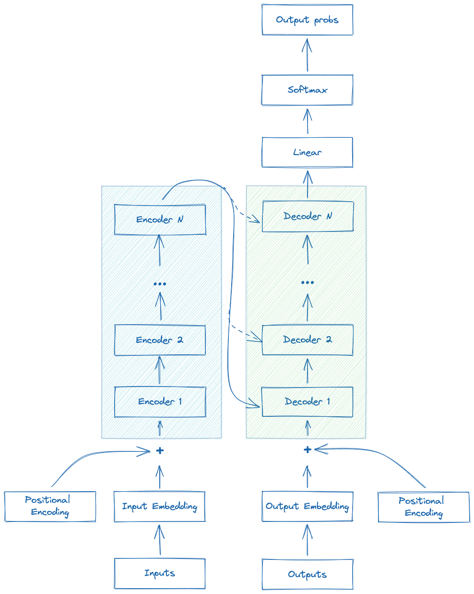
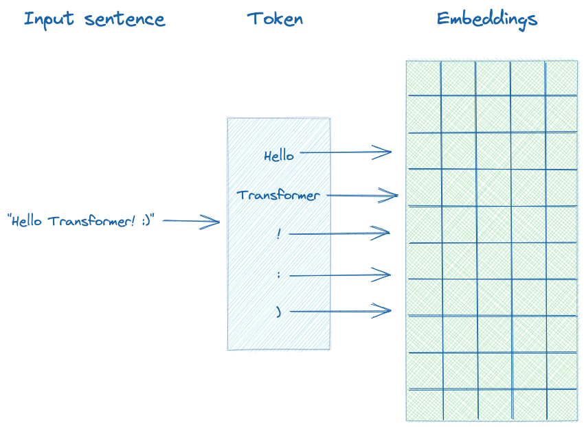
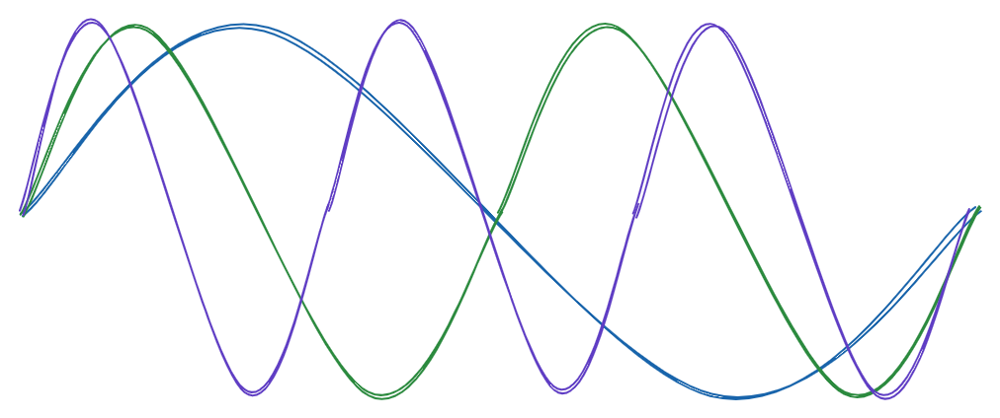
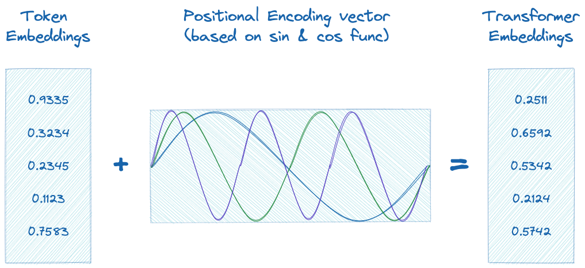
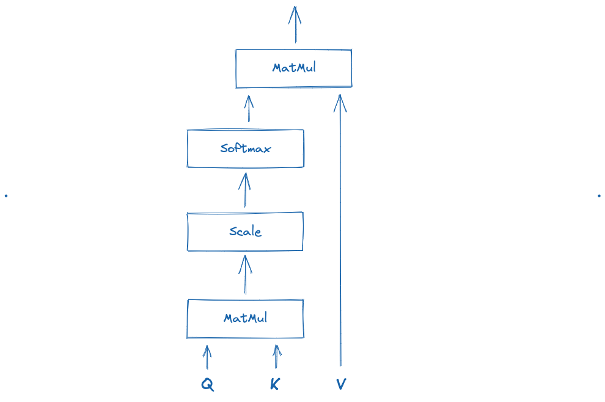
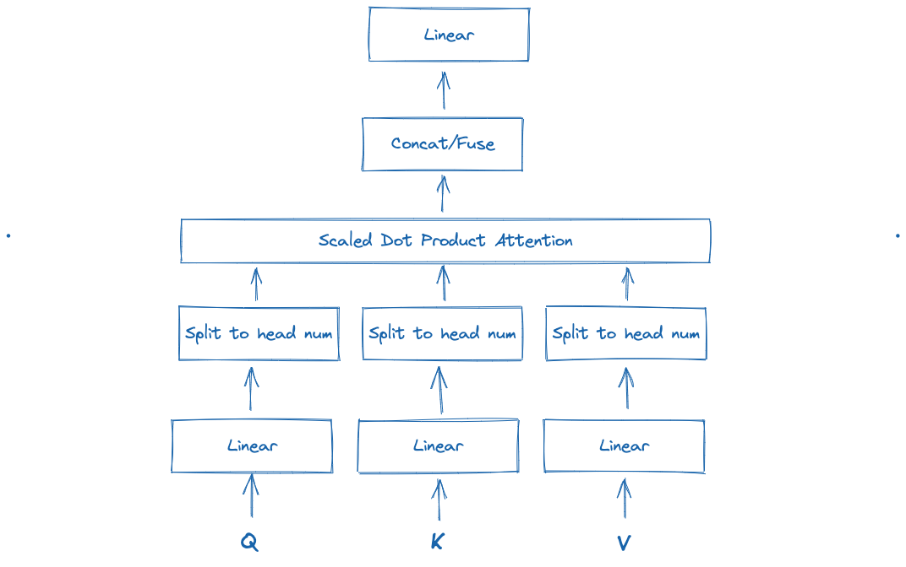
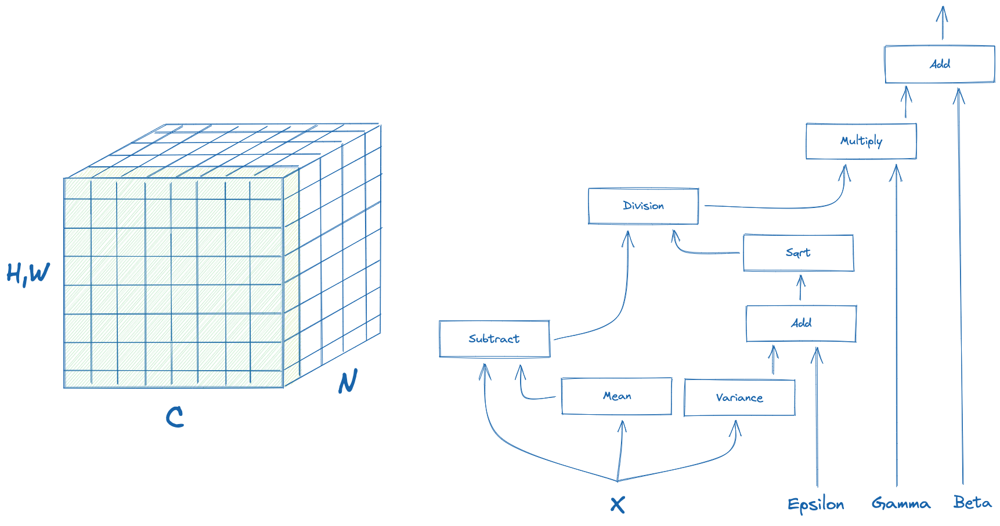
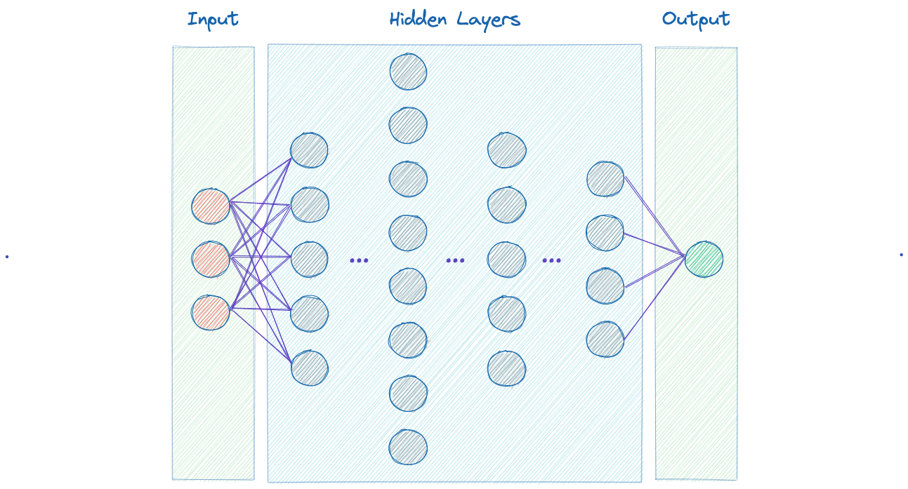
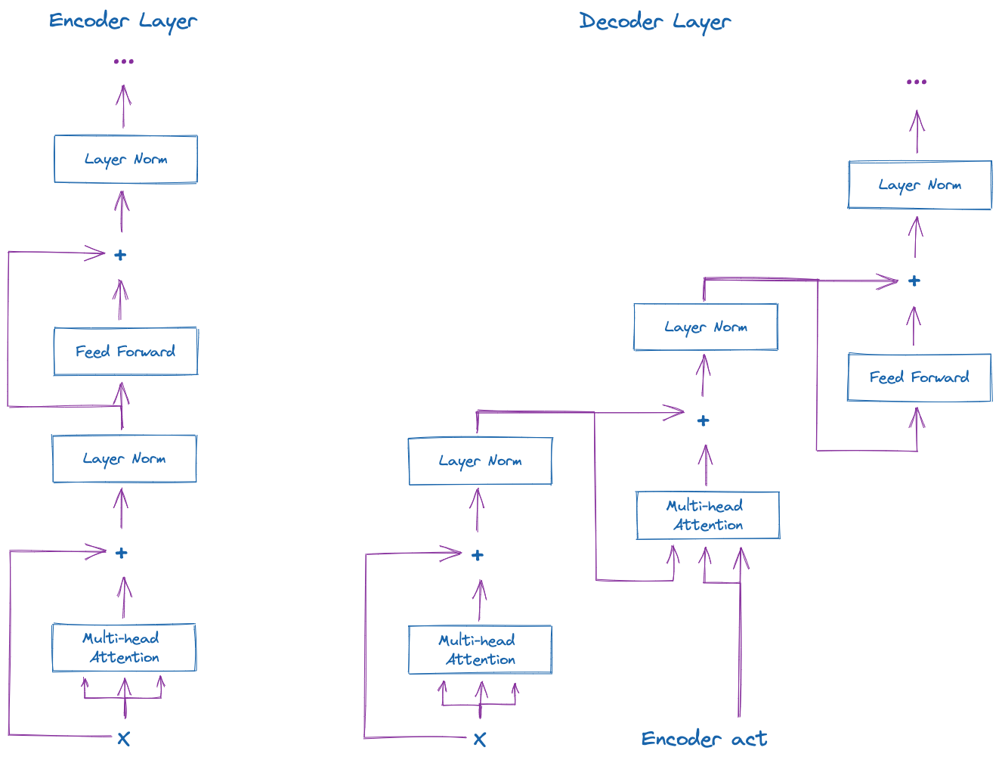

# Overview

A transformer is a deep learning model that adopts the mechanism of self-attention, differentially weighting the significance of each part of the input data. It is used primarily in the fields of natural language processing (NLP) and computer vision (CV) ([reference](https://en.wikipedia.org/wiki/Transformer_(machine_learning_model))).

Like recurrent neural networks (RNNs), transformers are designed to process sequential input data, such as natural language, with applications towards tasks such as translation and text summarization. However, unlike RNNs, transformers process the entire input all at once. The attention mechanism provides context for any position in the input sequence. For example, if the input data is a natural language sentence, the transformer does not have to process one word at a time. This allows for more parallelization than RNNs and therefore reduces training times.

Transformers were introduced in 2017 by a team at Google Brain and are increasingly the model of choice for NLP problems, replacing RNN models such as long short-term memory (LSTM). The additional training parallelization allows training on larger datasets. This led to the development of pretrained systems such as BERT (Bidirectional Encoder Representations from Transformers) and GPT (Generative Pre-trained Transformer), which were trained with large language datasets, such as the Wikipedia Corpus and Common Crawl, and can be fine-tuned for specific tasks.

# Token embedding

Token embeddings simply represent kind of a lookup table:

$$ X \rightarrow Y $$

This table is used to encode certain words into their token representation ([reference](https://pytorch.org/docs/stable/generated/torch.nn.Embedding.html)).

# Positional encoding

Positional encoding ([reference](https://machinelearningmastery.com/a-gentle-introduction-to-positional-encoding-in-transformer-models-part-1/)) describes the location or position of an entity in a sequence so that each position is assigned a unique representation.

The positional encoding is given by sine and cosine functions of varying frequencies:

$$ P(k, 2i) \sin\Big(\frac{k}{n^{2i/d}}\Big) $$

$$ P(k, 2i+1) \cos\Big(\frac{k}{n^{2i/d}}\Big) $$

where is:

$k:$ Position of an object in input sequence

$d:$ Dimension of the output embedding space

$P(k, j)$: Position function for mapping a position $k$ in the input sequence to index $k, j$  of the positional matrix

$n$: User defined scalar. Set to 10,000 by the authors of _"Attention is all You Need"_

$i$: Used for mapping to column indices. A single value of $i$ maps to both sine and cosine functions

# Transformer embedding

In sum, as all inputs are processed at once, transformers embedding represents addition of the token embedding and positional embedding ([reference](https://www.baeldung.com/cs/transformer-text-embeddings)). More precisely, as positional encoding vector and each token embedding vectors are added, the summed transformer embedding now represents a special embedding with positional information within it.

# Scaled Dot-Product Attention

Scaled dot-product attention is an attention mechanism where the dot products are scaled down by $\sqrt{d_k}$ ([reference](https://paperswithcode.com/method/scaled)). Formally we have a query $Q$, a key $K$ and a value $V$ and calculate the attention as:

$$ {\text{Attention}}(Q, K, V) = \text{softmax}\left(\frac{QK^{T}}{\sqrt{d_k}}\right)V $$

If we assume that $q$ and $k$ are $d_k$-dimensional vectors whose components are independent random variables with mean $0$ and variance $1$, then their dot product, $q \cdot k = \sum_{i=1}^{d_k} u_iv_i$, has mean $0$ and variance $d_k$. Since we would prefer these values to have variance $1$, we divide by $\sqrt{d_k}$.

# Multi-head Attention

Multi-head Attention is a module for attention mechanisms which runs through an attention mechanism several times in parallel ([reference](https://paperswithcode.com/method/multi-head-attention)). The independent attention outputs are then concatenated and linearly transformed into the expected dimension. Intuitively, multiple attention heads allows for attending to parts of the sequence differently (e.g. longer-term dependencies versus shorter-term dependencies).

$$ \text{MultiHead}\left(\textbf{Q}, \textbf{K}, \textbf{V}\right) = \left[\text{head}_{1},\dots,\text{head}_{h}\right]\textbf{W}_{0} $$

where

$$ \text{ head}_{i} = \text{Attention} \left(\textbf{Q}\textbf{W}_{i}^{Q}, \textbf{K}\textbf{W}_{i}^{K}, \textbf{V}\textbf{W}_{i}^{V} \right) $$

Above  are all learnable parameter matrices.

Note that scaled dot-product attention is most commonly used in this module, although in principle it can be swapped out for other types of attention mechanism.

# Layer Normalization

Layer Normalization directly estimates the normalization statistics from the summed inputs to the neurons within a hidden layer so the normalization does not introduce any new dependencies between training cases ([reference](https://leimao.github.io/blog/Layer-Normalization/)).

We calculate it in the following fashion:

$$ y_i = \gamma \hat{x}_{i} + \beta \equiv {\text{LN}}_{\gamma, \beta} (x_i) $$

where $\hat{x}_{i,k}$ is equal to:

$$ \hat{x}_{i,k} = \frac{x_{i,k}-\mu_i}{\sqrt{\sigma_i^2 + \epsilon}} $$

while $\mu_i$ and $\sigma_i^2$ are:

$$ \mu_i = \frac{1}{K} \sum_{k=1}^{K} x_{i,k} $$

$$ \sigma_i^2 = \frac{1}{K} \sum_{k=1}^{K} (x_{i,k} - \mu_i)^2 $$

# Positional Feed Forward

Position-Wise Feed-Forward Layer is a type of feed-forward layer consisting of two dense layers that applies to the last dimension, which means the same dense layers are used for each position item in the sequence, so called position-wise ([reference](https://paperswithcode.com/method/position-wise-feed-forward-layer)).

Simply, it can be represented as follows:

$$ FFN(x) = max(0, xW_1 + b_1) + W_2 + b_2 $$

# Encoder & Decoder Layer

